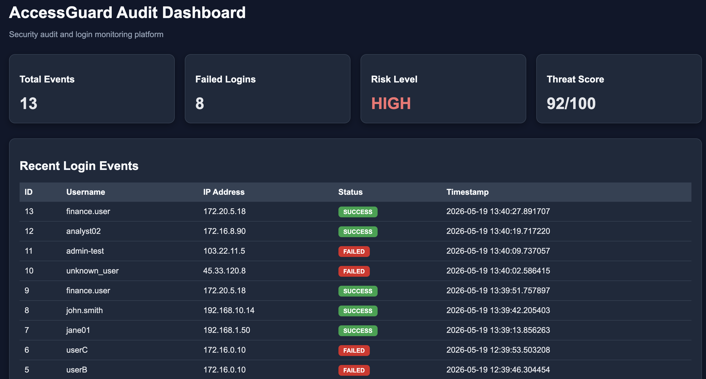
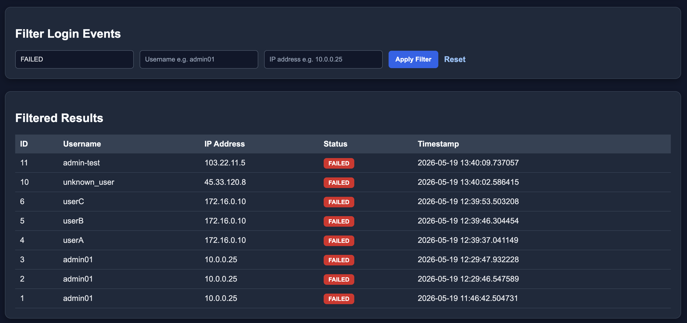
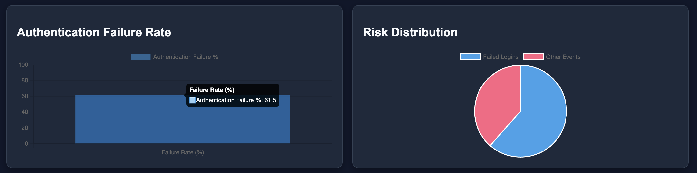
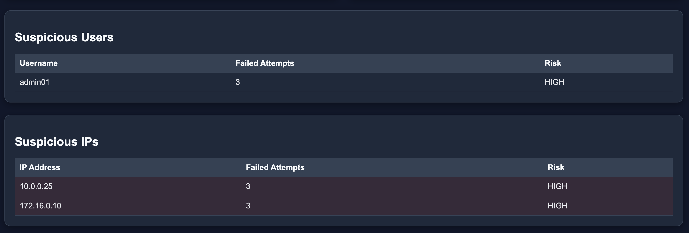
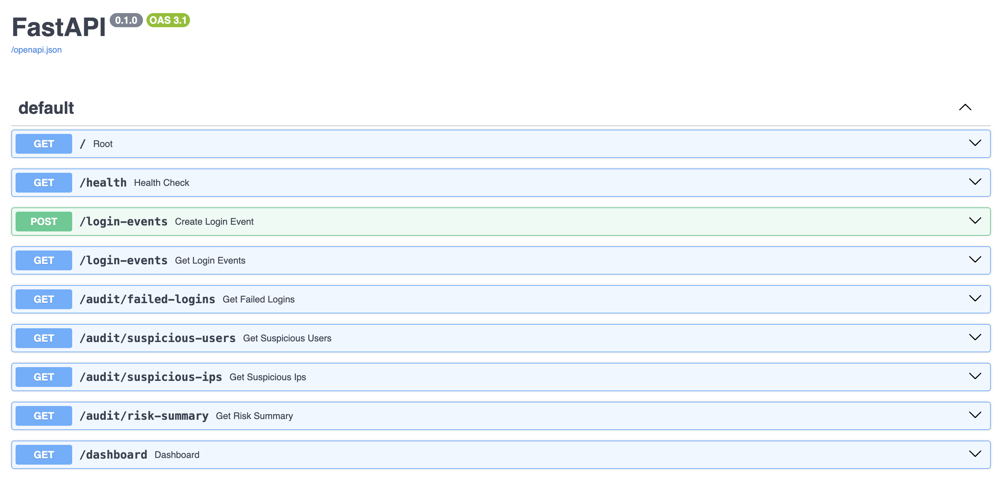
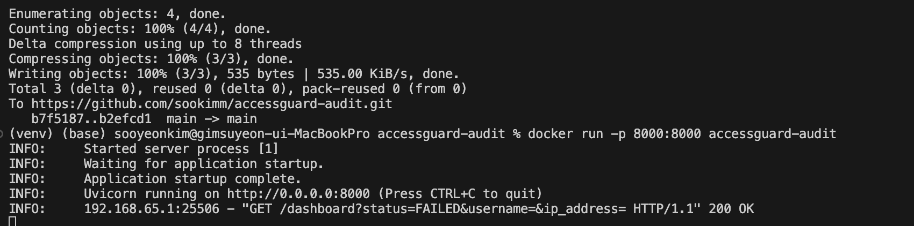

# AccessGuard Audit

## Overview

AccessGuard Audit is a security monitoring and audit analysis platform inspired by enterprise operational tooling and authentication monitoring systems.

The application analyzes login activity, detects suspicious authentication behavior, and provides an interactive investigation dashboard for security monitoring workflows.

This project was designed to simulate backend monitoring concepts commonly used in enterprise environments, including:

- authentication auditing
- suspicious activity detection
- threat scoring
- monitoring dashboards
- investigation workflows
- audit analytics

---

# Features

## Security Monitoring APIs

- Create login events
- Track failed login attempts
- Detect suspicious users
- Detect suspicious IP addresses
- Generate risk summaries
- Calculate authentication failure rates
- Generate threat scores

---

## Interactive Dashboard

- Dark mode enterprise-style dashboard
- Security analytics cards
- Authentication failure visualization
- Risk distribution charts
- Recent login monitoring
- Interactive filtering workflow
- Threat analysis dashboard

---

## Investigation Workflow

Supports filtering login events by:

- Status
- Username
- IP address

Example API queries:

```bash
/login-events?status=FAILED

/login-events?username=admin01

/login-events?ip_address=172.16.0.10
```

---

# Tech Stack

## Backend

- Python 3.13
- FastAPI
- SQLAlchemy
- SQLite

## Frontend / Dashboard

- Jinja2 Templates
- HTML/CSS
- Chart.js

## DevOps

- Docker

---

# Architecture

```text
app/
├── main.py
├── database.py
├── models/
├── routes/
├── services/
├── templates/
└── static/
```

## Project Structure

- `routes/` → API endpoints and dashboard routes
- `services/` → business logic and audit analysis
- `models/` → SQLAlchemy database models
- `templates/` → dashboard UI templates
- `database.py` → database configuration

---

# Dashboard Features

## Security Metrics

- Total Events
- Failed Logins
- Risk Level
- Threat Score

## Visualizations

- Authentication Failure Rate
- Risk Distribution Charts
- Suspicious User Analysis
- Suspicious IP Analysis

## Investigation Workflow

- Recent login monitoring
- Interactive filtering
- Filtered investigation results

---

# Screenshots

## Dashboard Overview



---

## Dashboard Filtering Workflow



---

## Security Charts



---

## Suspicious Entity Detection



---

## Swagger API Overview



---

## Docker Container Deployment



---

# Running Locally

## Clone Repository

```bash
git clone https://github.com/sookimm/accessguard-audit.git

cd accessguard-audit
```

---

## Create Virtual Environment

```bash
python -m venv venv
```

---

## Activate Virtual Environment

### macOS / Linux

```bash
source venv/bin/activate
```

### Windows

```bash
venv\Scripts\activate
```

---

## Install Dependencies

```bash
pip install -r requirements.txt
```

---

## Run Application

```bash
uvicorn app.main:app --reload
```

---

# API Documentation

## Swagger UI

```text
http://127.0.0.1:8000/docs
```

## Dashboard

```text
http://127.0.0.1:8000/dashboard
```

---

# Docker Setup

## Build Docker Image

```bash
docker build -t accessguard-audit .
```

---

## Run Docker Container

```bash
docker run -p 8000:8000 accessguard-audit
```

---

# Example Login Event

```json
{
  "username": "admin01",
  "ip_address": "172.16.0.10",
  "status": "FAILED"
}
```

---

# Future Improvements

- Advanced brute-force detection
- Real-time monitoring
- Exportable audit reports
- Authentication system
- Cloud deployment
- Alert notifications

---

# Project Goal

The purpose of this project is to demonstrate:

- Backend API development
- Security monitoring concepts
- Dashboard visualization
- Audit workflow design
- Database integration
- Enterprise tooling architecture
- Containerized application deployment
- Interactive investigation workflows
